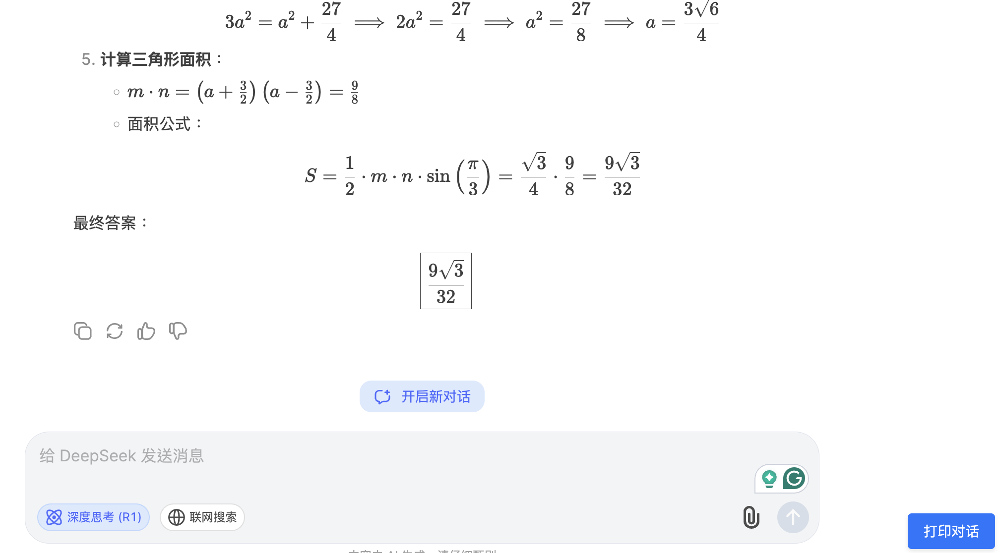
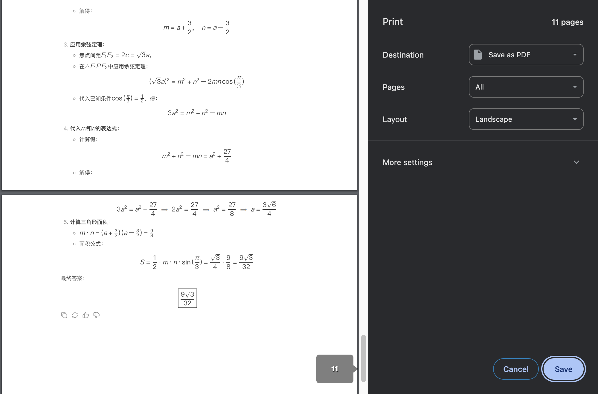

# Better DeepSeek Print

一个为 DeepSeek Chat 优化的打印扩展，完美支持数学公式渲染。

## 效果展示

### 打印按钮与界面

### 数学公式打印效果

## 主要特点

- 一键打印对话内容
- 完美支持数学公式渲染
- 保持原始样式和布局
- 自动处理隐藏内容
- 简单易用，无需配置

## 为什么需要这个扩展？

在使用 DeepSeek Chat 时，如果对话中包含数学公式，直接打印可能会出现以下问题：
- 公式渲染错误
- 不必要的换行
- 样式丢失

这个扩展解决了这些问题，让你可以完美打印对话内容。

## 安装方法

1. 下载本项目代码
   - 点击本页面右上角的 "Code" 按钮
   - 选择 "Download ZIP"
   - 解压下载的文件

2. 在 Chrome 中加载扩展
   - 打开 Chrome 浏览器
   - 访问 `chrome://extensions/`
   - 开启右上角的 "开发者模式"
   - 点击 "加载已解压的扩展程序"
   - 选择解压后的 `src` 目录

## 使用方法

1. 安装扩展后，访问 DeepSeek Chat 页面
2. 页面右下角会出现 "打印对话" 按钮
3. 点击按钮即可打印当前对话内容

## 使用提示

- 确保页面完全加载后再点击打印
- 在打印预览中可以调整纸张方向和边距
- 建议使用 "无边距" 选项以获得最佳效果

## 常见问题

Q: 为什么安装时提示 "无法添加来自此网站的应用、扩展程序和用户脚本"？
A: 这是因为扩展没有在 Chrome 商店发布。开启开发者模式后即可安装。

Q: 扩展安装后没有看到打印按钮？
A: 请刷新 DeepSeek Chat 页面。如果仍然没有，请确保网址匹配 deepseek.com。

## 贡献代码

欢迎提交 Pull Request 来改进这个扩展。主要改进方向：
- 支持更多数学公式样式
- 添加自定义打印选项
- 优化打印预览

## 许可证

MIT License 