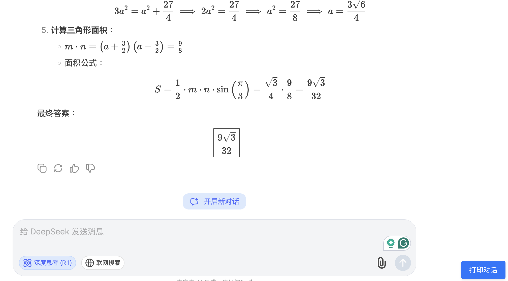

# Better DeepSeek Print

一个为 DeepSeek Chat 优化的打印扩展，完美支持数学公式渲染。

**注意：** 如果需要更全面的截图和打印解决方案，可以考虑使用 [FireShot](https://chromewebstore.google.com/detail/mcbpblocgmgfnpjjppndjkmgjaogfceg)，它提供了完整网页截图和额外的编辑功能。

## 效果展示

### 打印按钮与界面

### 数学公式打印效果

## 主要特点

- 一键打印对话内容
- 完美支持数学公式渲染

## 安装方法

1. 下载本项目代码
   - 点击本页面右上角的 "Code" 按钮
   - 选择 "Download ZIP"
   - 解压下载的文件

2. 在 Chrome 中加载扩展
   - 打开 Chrome 浏览器
   - 访问 `chrome://extensions/`
   - 开启右上角的 "开发者模式"
   - 点击 "加载已解压的扩展程序"
   - 选择解压后的 `src` 目录

## 使用方法

1. 安装扩展后，访问 DeepSeek Chat 页面
2. 页面右下角会出现 "打印对话" 按钮
3. 点击按钮即可打印当前对话内容

## 常见问题

### 打印问题

Q: 在 Mac 上使用 Chrome 打印时不显示文字怎么办？  
A: 这主要是因为 Mac 字体缺失问题。解决方法：
1. 打开 Chrome 设置 (chrome://settings/)
2. 进入 "外观" -> "自定义字体"
3. 查看页面中使用的字体
4. 在 Mac 的 Font Book 应用中下载这些字体
5. 重新加载网页后再次尝试打印 